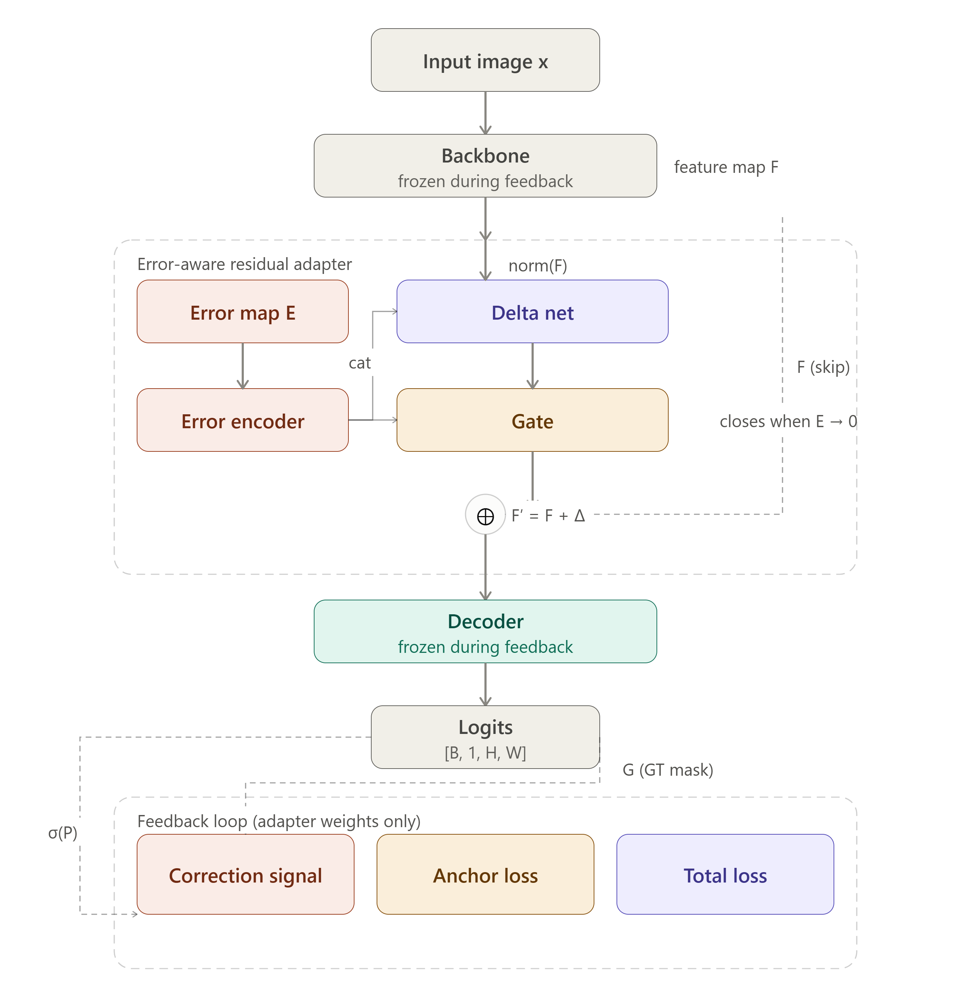

## Deep Human Feedback Learning (DHFL) for Image Segmentation Models

Deep Human Feedback Learning (DHFL) is a lightweight feedback-learning framework for image segmentation models. Instead of retraining an entire model after receiving user corrections, DHFL introduces an Error-Aware Residual Adapter that learns from corrected masks while keeping the backbone and decoder frozen.

The DHFL framework is designed for interactive segmentation systems where human feedback is available after an initial prediction.

---

## Overview

This repo contains the source code of the python packages for the DHFL framework and examples of using it with existing models. Currently, the DHFL framework only supports PyTorch, and for the detailed discussion of the DHFL, please read its paper on: 


The following directory that can be found in this repo are:
- [source code](dhfl_app/) which containes the source code for the DHFL framework. This is needed to be installed to use and run experiments.
- [examples](examples/) which containes examples of using the DHFL framework in MedSAM model.

---

## Architecture

DHFL consists of three main components: 
1. The Error Map - that is the computed error features from the ground truth or corrected masks and the predicted mask of the model. This is represented as $E = GT - \sigma(P)$, where it is then used to compute for the $\Delta$;
2. The Error-Aware Residual Adapter - where it recieves the encoded feature maps of the base model and the computed error map $E$. It is encoded and concatenated with normalized feature maps and where the $\Delta = f(F, E)$ is represented. This is where the corrected features become as $F' = F + \Delta$;
3. The Error Gate - which produces a scalar that either lets the adapter freely update or suppress it completely. It is responsible in producing small updates when there are small errors, large updates when there are stronger corrections or errors, and producing no update when there is no error.



---

## Installation

```bash
git clone https://github.com/Pacsss/DHFL-for-Segmentation.git
cd dhfl
pip install -r requirements.txt
```

---

## Quick Start

```python
from dhfl import (
    ErrorAwareResidualAdapter,
    feedback_step,
    create_anchor,
)

adapter = ErrorAwareResidualAdapter(
    channels=256,
    bottleneck_channels=64
)

anchor = create_anchor(model)

result = feedback_step(
    model=model,
    optimizer=optimizer,
    image=image,
    corrected_mask=corrected_mask,
    anchor=anchor,
)
```

DHFL is designed to be architecture-agnostic. The framework can be integrated into existing segmentation models by inserting the Error-Aware Residual Adapter between the encoder and decoder. These includes but not limited to:
- U-Net
- DeepLabV3+
- SegFormer
- SAM / MedSAM
- Custom encoder–decoder segmentation models

The encoder and decoder must remain frozen during feedback. This allow only the adapter to learn from human corrections and enables parameter-efficient updates without retraining the entire model

---

## Build .exe (for Windows)
You can also try the interactive segmentation and annotation tool that is made with the DHFL. Using this, you can correct the predictions of the model manually or using ground truth masks. 

# Initial Requirements

```bash
pip install -r requirements.txt
python app.py
```

You can download the required version that the DHFL app runs through intalling the .txt file provided in the repo.

After that, you can freely download and use the DHFL app through the provided zip file in the repo, [Download DHFL App](DHFL.zip)

In using the app, take note that:
- Large model weights are need to be downloaded and are not included in the zip file.

| Backbone      | Filename                  | Download |
|---------------|---------------------------|----------|
| MedSAM ViT-B  | medsam_vit_b.pth          | https://huggingface.co/flaviagiammarino/medsam-vit-base |
| SAM ViT-B     | sam_vit_b_01ec64.pth      | https://huggingface.co/facebook/sam-vit-base |
| UNet ResNet34 | (auto-downloads)          | torchvision |
| Lightweight   | (bundled, no download)    | — |

- You can also create your own encoder and decoder in a `.py` file with a class subclassing `BackboneBase` and must be in the `weights/` directory. You can load and use this instead of the following pretrained models.

```python
from core.backbone_base import BackboneBase
from torch import Tensor

class MyBackbone(BackboneBase):

    @property
    def name(self) -> str:
        return "My Custom Backbone"

    @property
    def feature_channels(self) -> int:
        return 256   # must match your model's output channels

    def load(self, weights_path=None, device="cpu"):
        import torch
        self._model = torch.load(weights_path).to(device).eval()
        self._loaded = True

    def preprocess(self, x: Tensor) -> Tensor:
        return x   # add your normalization here

    def forward(self, x: Tensor) -> Tensor:
        return self._model(x)   # return [B, feature_channels, H/s, W/s]
```

Finally, you can save the adapters which includes adapter weights, decoder weights, anchor state, and full step history. They are backbone-specific — you need to load the same backbone before loading an adapter file when using it again.

---

## Citation

If you use DHFL in your research, 

```bibtex
@article{pacayra2026dhfl,
  title={Deep Human Feedback Learning for Image Segmentation},
  author={Pacayra, Justin A.},
  year={2026}
}
```

---

## License

This project is released under the MIT License.
